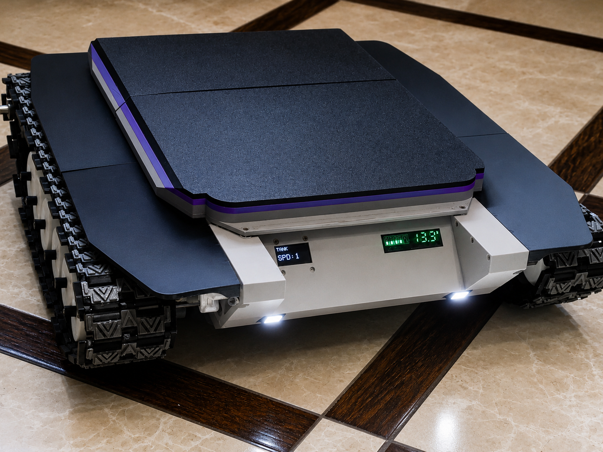
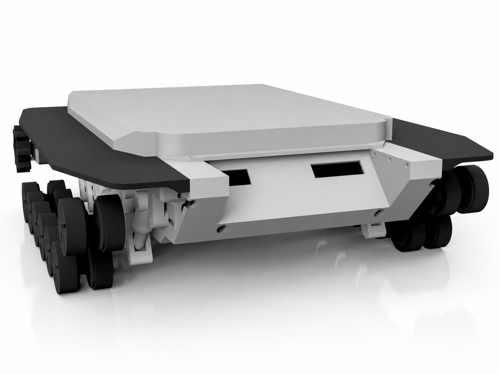
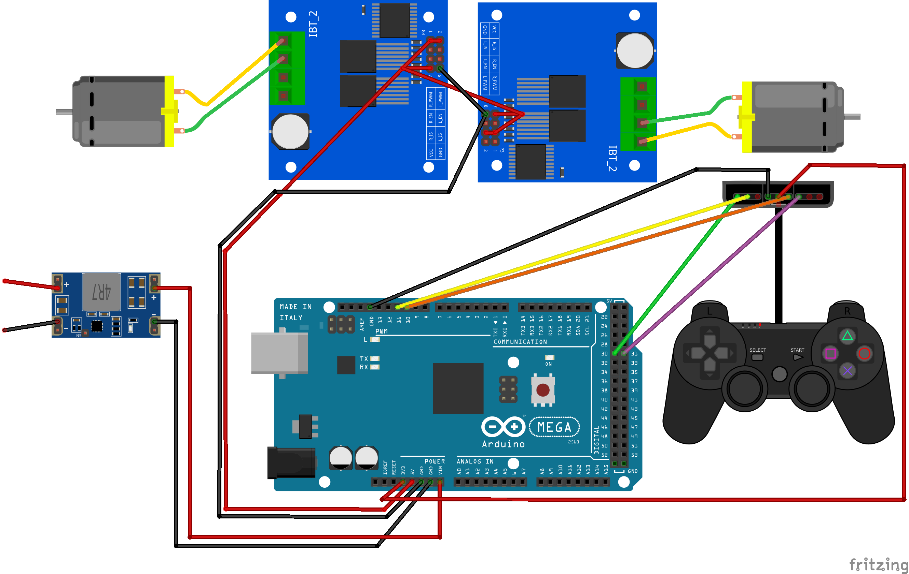
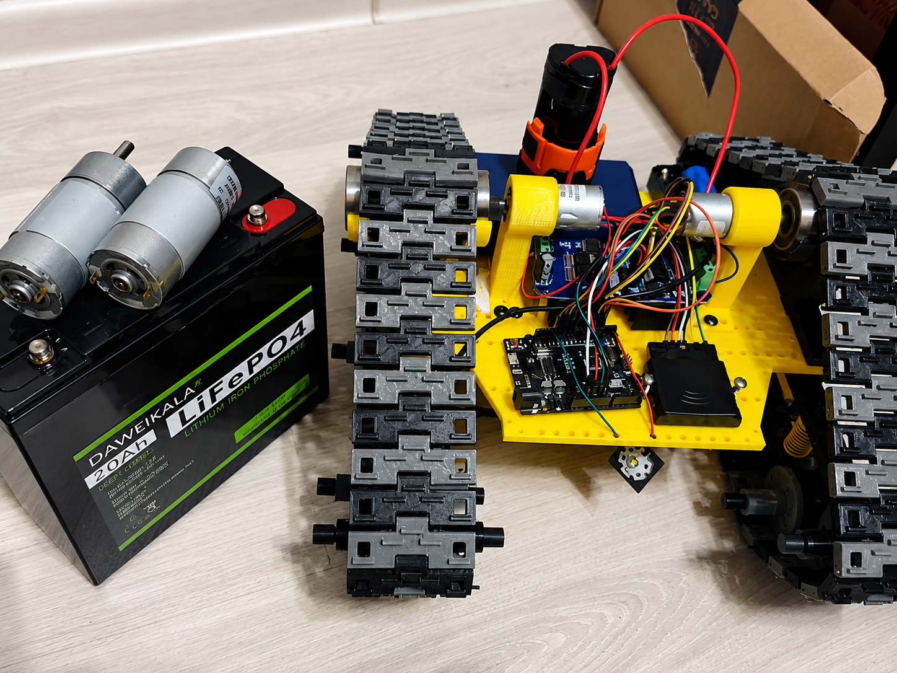
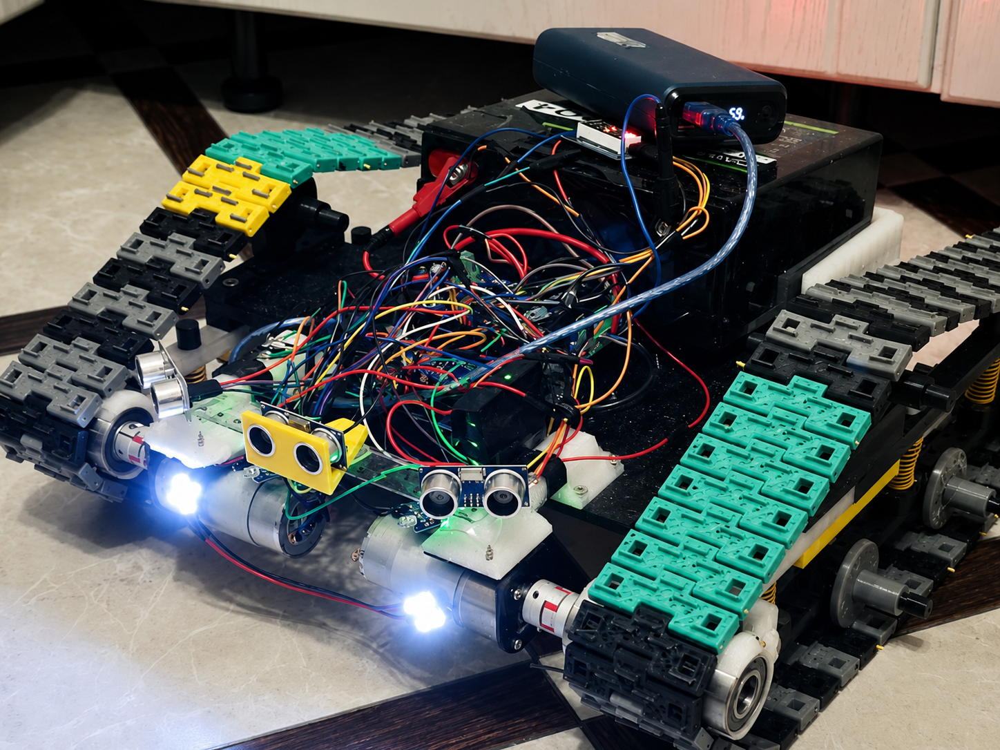
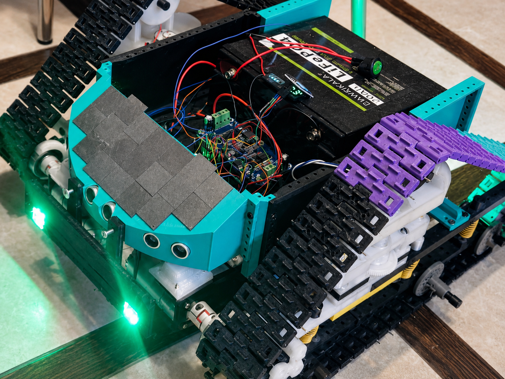

# **Робот на Arduino (Вилли) *v4.1.0***
[English](README.md)

### Статус: 🚧 В разработке

### Управляемая гусеничная платформа, задуманная как полу-развлекательный проект для обучения различным навыкам с постоянной эволюцией. Большинство деталей корпуса пластиковые и напечатаны на 3D-принтере. Это уже 4-я версия робота, в которой я убрал лишние функции и электронику, чтобы сконцентрироваться на ходовой.

## **СОДЕРЖАНИЕ**
 - [📦**Компоненты**](#компоненты)
 - [🔌**Схема подключения**](#схема-подключения)
 - [🧩**3D модели**](#3d-модели)
 - [🧠**Как это работает**](#как-это-работает)
 - [🎬**Демонстрация**](#демонстрация)
 - [🚀**Планы по улучшению**](#планы-по-улучшению)
 - [📜**Прошлые версии**](#прошлые-версии)

## **📦КОМПОНЕНТЫ**

| # | Компонент | Особенности | Кол-во |
|---|-----------|---------------|-----|
| 1 | Arduino Mega | ATmega2560 | 1 |
| 2 | Gamepad | PS2 Dualshock 2.4GHz (wireless) | 1 |
| 3 | Motor Driver | BTS7960 (43A) | 2 |
| 4 | DC Motor | JGB37-555 (12V, 960 RPM) | 2 |
| 5 | OLED Display | 0.96" 128x64, I2C (4-pin) | 1 |
| 6 | Battery | LiFePO4 (12V, 20Ah) | 1 |
| 7 | Step-Down (5V) | Mini560 (Input 7-20V → Output 5V) | 1 |
| 8 | Step-Down (3.3V) | Mini560 (Input 5-20V → Output 3.3V) | 1 |
| 9 | LED Matrix | 2×2 RGB | 2 |
| 10 | High-Power LED | 1W, 3.3V | 2 |
| 11 | Relay | 5V coil | 1 |
| 12 | Battery Indicator | LiFePO4 compatible | 1 |

## **🔌СХЕМА ПОДКЛЮЧЕНИЯ**

## **🧩3D МОДЕЛИ**

### **Исходники Fusion 360 и STL файлы для печати:** 
## [📁 cad/](cad/)
### **Рекомендации по печати**
- ### Материал: PETG или ABS
- ### Заполнение: > 30%
- ### Слои стенок: > 4

## **🧠КАК ЭТО РАБОТАЕТ**

**Программа настроена на два основных режима управления:**    
&nbsp;&nbsp;&nbsp;&nbsp;*ОБЫЧНЫЙ* - управление левым стиком  
&nbsp;&nbsp;&nbsp;&nbsp;*ТАНКОВЫЙ* - управление рычагами L/R(1/2)  
Для переключения между режимами: короткое нажатие *ЗЕЛЕНОЙ* кнопки (треугольник)  
Также в обоих режимах есть подрежим *РЕВЕРС*: длительное нажатие *КРАСНОЙ* кнопки (кружок)  
Стрелки *ВВЕРХ/ВНИЗ*: переключение скорости (1/2/3)

&nbsp;&nbsp;&nbsp;&nbsp;*--На дисплее можно отслеживать текущий режим--*   

**Включение и выключение света: короткое нажатие *РОЗОВОЙ* кнопки (квадрат)**  
Зажатая кнопка *SELECT* + *L/R2*: переключение цвета задних фар  
Зажатая кнопка *SELECT* + стрелка *ВНИЗ*: аварийный режим, с миганием задних красных фар  
Зажатая кнопка *SELECT* + стрелка *ВЛЕВО*: возврат к обычному освещению задних фар

## **🎬ДЕМОНСТРАЦИЯ**

<video src="https://github.com/user-attachments/assets/24fbcfbd-a209-40d3-9cdd-c5182fa0e057" controls width="100%"></video>

## **🚀ПЛАНЫ ПО УЛУЧШЕНИЮ**

## Ближайшие
- Тесты и повышение надежности электронники
- Измерение температуры двигателей и цветовая RGB индикация + вывод на дисплей 
- Создание удобного разъёма для зарядки аккумулятора через штекер
- Вынос usb микроконтроллера для удобного подключения

## В будущем
- Пересмотр конструкции, создание простых и прочных соединений
- Тесты и повышение надежности ходовой

## Когда-нибудь
- Перенос дистанционнокго управления по NRF
- Создание собственного пульта-приемника
- Переход с Arduino Mega на одноплатник или ESP

## **📜ПРОШЛЫЕ ВЕРСИИ**

### В предыдущих версиях были интересные функции, такие как: электронная натяжка гусениц с пульта, автоматический режим движения на ультразвуковых датчиках, два режима ручного управления и множество возможностей подсветки. До этого времени я не собирал медиа о проекте, поэтому осталось лишь несколько не самых удачных фотографий.

